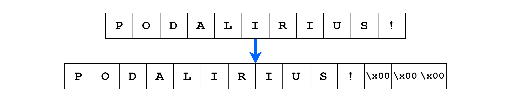
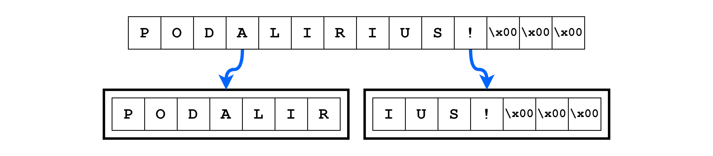
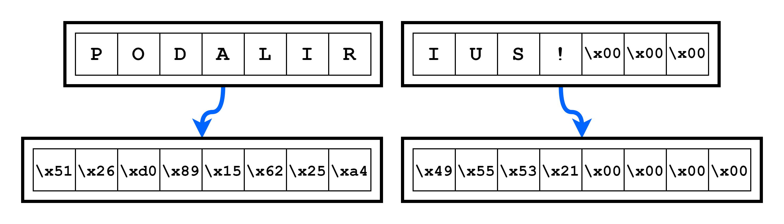
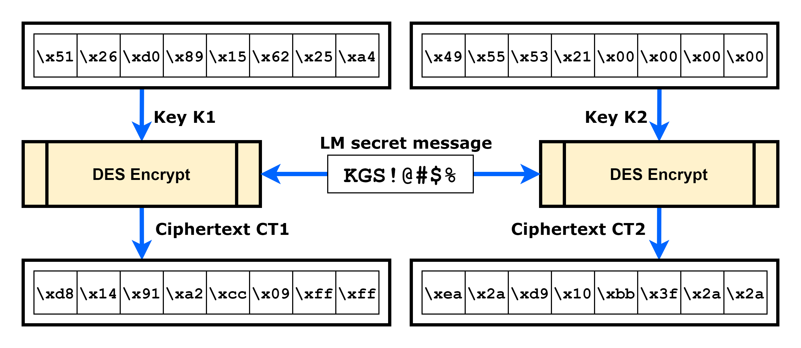
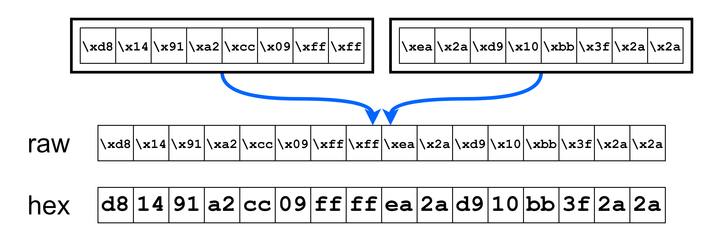

# Lan Man (LM)

The Lan Man (LM) hash is a password hashing algorithm used in older versions of Microsoft Windows operating systems. It was created in the early 1980s as a way to store user passwords securely. However, the LM hash is considered to be weak and vulnerable to various attacks due to its limitations and vulnerabilities.

The LM hash operates by converting the user's password to uppercase and padding it with null bytes to a length of 14 bytes. The padded password is then split into three blocks of 7 bytes each. Parity bits are added to each block, and each block is encrypted using two separate DES keys, known as K1 and K2. The resulting ciphertexts are concatenated to form the final LM hash.

Despite its historical significance, the LM hash is no longer recommended for use due to its vulnerability to pre-computed hash attacks and its inability to handle passwords longer than 14 characters. Modern Windows operating systems have transitioned to more secure password hashing algorithms, such as NTLM and NTLMv2.

---

## Step by Step computation

### 1. Setting the password in uppercase

The first step to create the LM hash is to set the password in uppercase:


### 2. Padding the password with null-bytes to a length 14 bytes

If the password is shorter than 14 bytes, we need to add padding null-bytes until it reaches a length of 14 bytes. If it is longer than 14 bytes, we just keep the first 14 bytes.



### 3. Splitting the encoded padded password

We then split the encoded padded password in 3 blocks of 7 bytes:



### 4. Add a parity bit after each block of 7 bits



### 4. DES encrypt the LM secret using K1 and K2



### 6. Concat CT1 and CT2 to form the final hash

Finally we concat the ciphertexts of steps 4 and 5 together to form the LM hash:



---

## Example

Using the attached [lm-hash-from-password.py](./lm-hash-from-password.py) python script, we can see the step by step values for computing the LM hash:

```
$ ./lm-hash-from-password.py -p 'Podalirius!'
[+] Raw password: b'Podalirius!'
[+] Upper raw password: b'PODALIRIUS!\x00\x00\x00'
[+] Message part 1: 504f44414c4952 | b'PODALIR'
  | parity_adjust(K1) = 5126d089156225a4
  | CT1 = d81491a2cc09ff01
[+] Message part 2: 49555321000000 | b'IUS!\x00\x00\x00'
  | parity_adjust(K2) = 49ab546410010101
  | CT2 = ea2ad910bb3f2a2a
[+] Raw LM hash: b'\xd8\x14\x91\xa2\xcc\t\xff\x01\xea*\xd9\x10\xbb?**'
[+] LM hash: d81491a2cc09ff01ea2ad910bb3f2a2a
```

## References
 - 